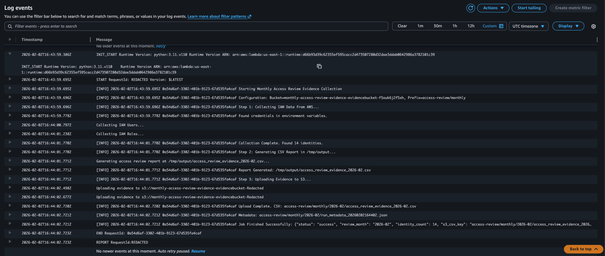
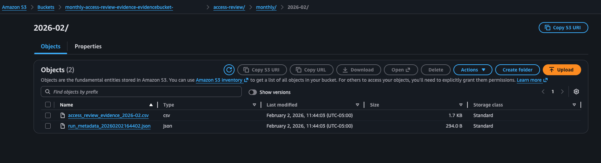

# GRC AWS Access Review Evidence Tool

An AWS-native GRC tool that performs scheduled IAM access reviews, generates audit-ready evidence, and retains artifacts for SOC 2 and similar compliance requirements.

This repository documents the **design, execution flow, and evidence chain** of the control. The implementation is demonstrated through screenshots and a walkthrough video.

---

## Why This Exists

Most organizations state that they perform periodic access reviews, but struggle to consistently prove:

- That the review actually ran
- When it ran
- What was reviewed
- Where the evidence is retained

Manual screenshots and ad-hoc spreadsheets do not scale and often fail under audit scrutiny.

This tool demonstrates how access reviews can be implemented as a **repeatable, verifiable GRC control** using AWS-native services.

---

## What the Tool Does

On a monthly schedule, the tool:

1. Collects AWS IAM users and roles using read-only access
2. Flags access patterns that require review
3. Generates a CSV access review evidence file
4. Uploads evidence and metadata to Amazon S3
5. Records a full execution audit trail in CloudWatch

No permissions are modified. Human review and approval remain required.

---

## Architecture Overview

EventBridge → Lambda → CloudWatch → S3

- EventBridge triggers the control on a fixed schedule
- Lambda performs access collection and report generation
- CloudWatch provides execution and audit logs
- S3 stores long-term evidence artifacts

This mirrors how modern SaaS GRC teams design and operate compliance controls.

---

## Evidence Chain

### Screenshot 1: Scheduled Execution
**What it proves:**  
The access review control is configured to run automatically on a monthly schedule.

---

### Screenshot 2: Execution Exists
**What it proves:**  
The Lambda function has executed and produced log streams.

---

### Screenshot 3: Execution Audit Trail
**What it proves:**  
When the review ran, how many identities were reviewed, and where the evidence was stored.

---

### Screenshot 4: Evidence Retention
**What it proves:**  
Monthly access review evidence is retained and retrievable for audits.

---

## Compliance Mapping

### SOC 2 Relevance

This tool supports evidence collection for:
- Periodic access reviews
- Logical access controls
- Audit sampling and walkthroughs

It does not replace governance decisions or approval workflows.

---

## What This Tool Is Not

- Not an enforcement or remediation tool
- Not an IAM scanner or identity governance platform
- Not a replacement for human access review decisions

This is a **GRC evidence and control-execution tool**.

---

## Walkthrough Demo

A full walkthrough of the control design, execution flow, and evidence artifacts is available here:

**YouTube Walkthrough:**  
[LINK TO VIDEO]

---

## Why This Matters

This project demonstrates:
- Practical GRC engineering
- Audit-first control design
- AWS-native automation
- Evidence over dashboards

It reflects how access reviews are actually implemented and defended in real-world SaaS environments.
